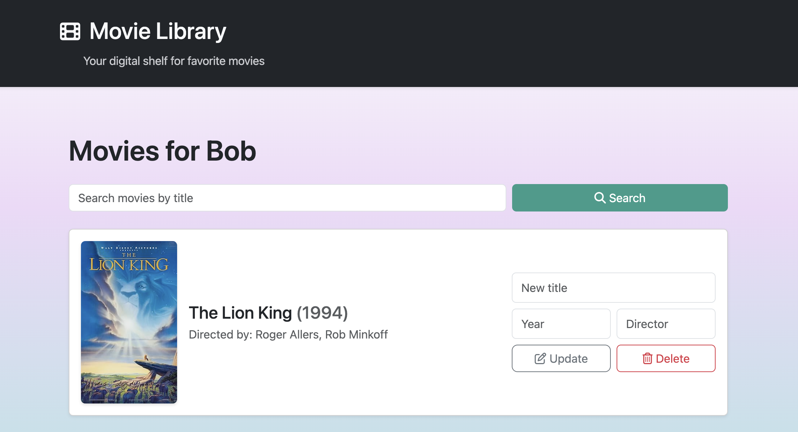

# Movie Library (MoviWeb App)  
*Your digital shelf for favorite movies*



A small Flask web application where users can keep a personal library of favourite movies.  
Each user has their own list, with movie data fetched from the OMDb API when available.

---

## 🚀 Live Demo

Try the app here:  
👉 https://Margarita.pythonanywhere.com

---

## Features

- 👤 **User management**
  - Create users (unique by name, case-insensitive)
  - Delete a user (with confirmation modal) – removes all their movies

- 🎬 **Personal movie library**
  - Add movies by title; details fetched from **OMDb**
  - Store title, year, director, and poster URL
  - Prevent adding the *same movie title twice* for the same user

- 🔍 **Search**
  - Search within a user’s movies by title (case-insensitive)

- ✏️ **Edit & delete**
  - Update title, year, and director directly from the movie list
  - Delete movies with a confirmation modal

- ⚠️ **Error handling & feedback**
  - Flash messages for success, validation issues, duplicates, and API problems
  - Custom 404 page for missing users/movies
  - Graceful fallback if OMDb can’t be reached (movie is still added by title only)

- 🎨 **UI & styling**
  - Bootstrap-based responsive layout
  - Custom CSS with soft gradient background and card-style design
  - Font Awesome icons for buttons and nav bar

---

## Tech Stack

- **Backend:** Python, Flask
- **Database:** SQLite with **Flask-SQLAlchemy** (ORM)
- **HTTP / API:** `requests` for OMDb API calls
- **Config:** `python-dotenv` for loading environment variables
- **Frontend:** HTML + Bootstrap 5 + custom CSS + Font Awesome (via CDN)

---

## Project Structure

```
MoviWebApp/
│
├─ app.py                # Flask app, routes, OMDb integration, error handling
├─ data_manager.py       # Data access layer using SQLAlchemy ORM
├─ models.py             # User and Movie ORM models
├─ requirements.txt      # Python dependencies
│
├─ data/
│   └─ movies.db         # SQLite database (created at first run)
│
├─ templates/
│   ├─ base.html         # Base layout with navbar & flash messages
│   ├─ index.html        # Users page: list, add, delete
│   ├─ movies.html       # Movies page: list, add, search, update, delete
│   └─ 404.html          # Custom "Page not found"
│
└─ static/
    └─ style.css         # Custom styling
├── docs/
│    └── screenshot.png  # Image for preview
└── README.md            # Current file
```

---

## Setup & Installation

### 1. Prerequisites

- Python 3.10+

### 2. Clone the repository

```bash
git clone https://github.com/margarita-bykadorova/MoviWebApp.git
cd MoviWebApp
```

### 3. Create and activate a virtual environment

```bash
python -m venv .venv
# macOS / Linux:
source .venv/bin/activate
# Windows (PowerShell):
# .venv\Scripts\Activate.ps1
```

### 4. Install dependencies

```bash
pip install -r requirements.txt
```

### 5. Environment variables (`.env`)

Create a file **`.env`** in the project root and add:

```env
SECRET_KEY=change_me_to_a_long_random_string
OMDB_API_KEY=your_omdb_api_key_here
```

- `SECRET_KEY`  
  Used by Flask for sessions and flash messages.  
  Use any long random string in development.

- `OMDB_API_KEY`  
  Your API key from http://www.omdbapi.com.  
  If this is **missing or invalid**, the app still works – it will just add movies using your title only (no poster/year/director).

### 6. Create the database

The app stores its SQLite database inside a `data/` directory.  
If it does not exist yet, create it manually:

```bash
mkdir data
```

The app will automatically create the `movies.db` file inside this folder on first run.


---

## Running the App

```bash
python app.py
```

Runs on:

```
http://127.0.0.1:5000/
```

---

## Usage Overview

### Users Page
- Create users  
- Delete users (with confirmation modal)  
- Open a user’s movie library  

### Movie Library
- Search movies  
- Add new movies (with OMDb enrichment)  
- Update movie title / year / director  
- Delete movies (with modal)  

Uniqueness is enforced: a user cannot add the same movie title twice.

---

## Future Enhancements

- Sorting movies by name/year/director  
- Movie tagging or rating system  
- Import/export movie list  
- User authentication system  

---

Enjoy using **Movie Library**! 🎬

---

## 💡 Author

Created by **[margarita-bykadorova](https://github.com/margarita-bykadorova)**  
